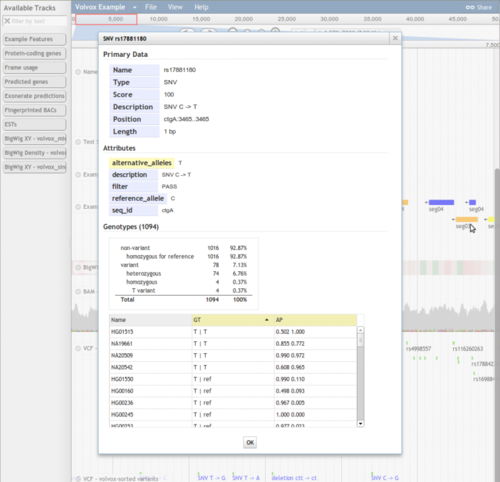

import Layout from "../components/Layout"

Merging VCF files
=================

**Introduction**

Recently, I was looking at a bunch of variant call files (VCF) where
each VCF represented it's own scaffold, and I sought to merge them
together to create a unified view. I decided to use GATK CombineVariants
and followed their guide for using it
[here](http://www.broadinstitute.org/gatk/gatkdocs/org_broadinstitute_sting_gatk_walkers_variantutils_CombineVariants.html).
It was fairly straightforward but there were some hiccups that i'll go
through here

*Variant detail view in JBrowse showing genotype statistics*

**CombineVariants wants a dict and samtools index file for the reference
genome**

In order to use GATK you first need to format some files for the
reference genome. I followed the GATK guide for doing so from
[here](http://gatkforums.broadinstitute.org/discussion/1601/how-can-i-prepare-a-fasta-file-to-use-as-reference).
The steps for formatting the reference are as follows:

-   Create a dict file for the FASTA using picard
-   Create a fai file using SAMtools

Here's the commands we used (and the error messages that clued me to do
it)

*First create a fai index. Note: You should use this step to create an
fai index if you get the error message: ERROR MESSAGE: Fasta index file
... for reference ... does not exist.*

>     samtools faidx Amel_4.5_scaffolds.fa

*Then create a dict index. Note: You should use this step from the
picard toolkit if you get this error: ERROR MESSAGE: Fasta dict file ...
for reference ... does not exist. *

>      java -jar CreateSequenceDictionary.jar R= ~/Amel_4.5_scaffolds.fa O= ~/Amel_4.5_scaffolds.fa.dict

**CombineVariants needs a sorted VCF\
**

GATK CombineVariants can be used after the reference is formatted, but
it gives errors if the VCF isn't sorted. I found the [following
discussion thread on
seqanswers](http://seqanswers.com/forums/showthread.php?t=11909%20) and
used vcfsorter to fix that problem <http://code.google.com/p/vcfsorter/>

>     # Note: You should use vcfsorter if you get the error message:
>     ##### ERROR MESSAGE: Input files ../myvcf.vcf and reference have incompatible contigs:
>     ###### Relative ordering of overlapping contigs differs, which is unsafe.
>      
>     for f in vcfGzip/*.vcf; do echo "Processing $f";
>         perl vcfsorter.pl ~/Amel_4.5_scaffolds.dict $f>$f.sorted.vcf;
>     done

This is probably just an alphanumeric sort on the chromosome names and a
numeric sort on the start position, so a custom unix "sort" might work
too i.e. sort -k1,1 -k 2,2n or similar

\

\
**Finally merge the variants with CombineVariants**

Generate a list of variants and then you are ready to piece together a
command to combine all your VCFs

>      CombineVariants java -jar GenomeAnalysisTK.jar -R Amel_4.5_scaffolds.fa -T CombineVariants \
>     --variant C181.vcf.sorted.vcf \
>     --variant C182.vcf.sorted.vcf \
>     --variant ...etc... \
>     -o combined.vcf -genotypeMergeOptions UNIQUIFY

I haven't explored all the genotypeMergeOptions, but this one was ok
enough to create a "reasonable" output for our purposes.

**Finalize the VCF by creating a BGZip archive and a Tabix index file**

BGzip and Tabix are companions of SAMtools to finalize a VCF file. I ran
programs Bgzip and Tabix on the combined variant file

>     ./bgzip ~/combined.vcf
>     ./tabix -p vcf ~/combined.vcf.gz

\
Then this creates combined.vcf.gz and combined.vcf.gz.tbi that can be
loaded into JBrowse easily.

\

Note: there is no custom VCF "loader" for jbrowse currently, but you can
just manually add it to your track list pretty easily, e.g. add this to
your trackList.json.

          {
             "label"         : "MyTrack",
             "storeClass"    : "JBrowse/Store/SeqFeature/VCFTabix",
             "urlTemplate"   : "combined.vcf.gz",
             "type"          : "JBrowse/View/Track/HTMLVariants"
          }

Also note: The tbiUrlTemplate is only necessary if your tabix index file
isn't named combined.vcf.gz.tbi (i.e., it automatically checks for the
url of your .vcf.gz file +".tbi"). Similar thing for baiUrlTemplate,
because it only needed if your BAM index isn't named bamfile.bam.bai
because it automatically checks for your the url of your bamfile +
".bai"

::: {#footer}
[ February 25th, 2014 8:09pm ]{#timestamp} [bioinformatics]{.tag}
[tutorial]{.tag} [vcf]{.tag} [gatk]{.tag} [samtools]{.tag}
:::

export default ({ children }) => <Layout>{children}</Layout>
