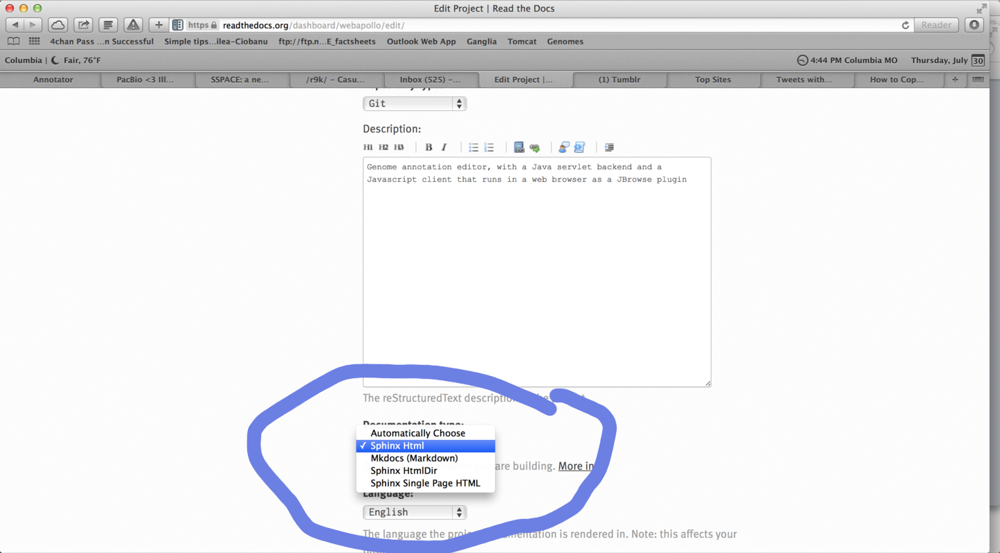
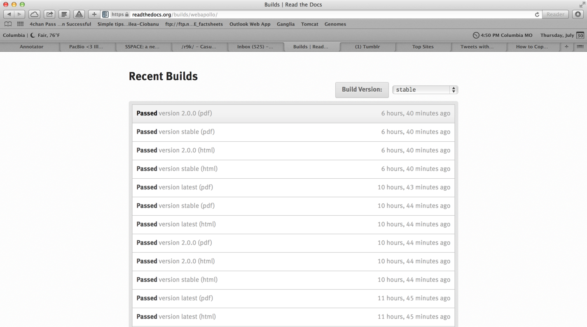

Making PDFs from Markdown on Readthedocs.org using sphinx
=========================================================

Readthedocs.org (RTD) is a great service to build a centralized resource
for your documentation. It works really well for programmers since you
can just push new documentation to your git repository and your
readthedocs.org webpage will be updated. On readthedocs, there are
essentially two parsers: mkdocs and sphinx, and it is generally pretty
easy to configure your Markdown builds with Mkdocs (not covered here),
but unfortunately, Mkdocs isn't able to generate a PDF of your
documentation. Not to fear though, you can actually configure the sphinx
build system to parse your markdown to build PDFs. The caveat is that
normally sphinx is not used for parsing markdown (it is used commonly
for reStructuredText), but with a little extra work, we can configure
sphinx to parse Markdown.

When I realized that we could really use a nice PDF guide, I started
converting our documentation to RST since it would work with sphinx
better, but then I saw this tweet talking about using Markdown with
Sphinx:

> Would you benefit from Markdown being available as a Sphinx input
> language? <http://t.co/XH0byxyV4Y>
> [#scipy2015](https://twitter.com/hashtag/scipy2015?src=hash)
> [#sphinx](https://twitter.com/hashtag/sphinx?src=hash)
> [#markdown](https://twitter.com/hashtag/markdown?src=hash)
> [#python](https://twitter.com/hashtag/python?src=hash)
>
> 

>
> --- Michael Aye (@michaelaye)
>
> 

>
> [July 14,
> 2015](https://twitter.com/michaelaye/status/621053125818908673)

I responded that this would be awesome, but Eric Holscher pointed out
that there is already some support for this, citing this repo
<https://github.com/ericholscher/sphinx-markdown-test/>.

So, very interested to test this out, I converted our existing docs to
parse Markdown and build awesome PDF and web-based docs on
readthedocs.org automatically.

**Step one:**

On your local machine `pip install sphinx`

**Step two:**

Run `sphinx-quickstart`, probably in your docs directory

**Step three:**

Follow sphinx-quickstart's guide. You can basically follow the defaults,
it is not too complicated. None of the options will really have any
bearing on your success :) The output directories don't matter either.
After completion, a conf.py and Makefile will typically be outputted.
Only the conf.py is needed by readthedocs.org. Readthedocs will scan the
whole repo for the conf.py file apparently, but I normally run the
sphinx-quickstart in the docs subdirectory.

**Step four:**

At the bottom of conf.py, add this:

> # The suffix of source filenames.
> from recommonmark.parser import CommonMarkParser
>
> # The suffix of source filenames.
> source_suffix = ['.rst', '.md']
>
> source_parsers = {
>    '.md': CommonMarkParser,
> }

This will enable the markdown parser for sphinx

**Step five:**

Replace your normal index.md with an index.rst. Having an index.rst will
allow you to create a table of contents guide. I am not 100% sure that
this needs the RST, maybe the toctree can be made in Markdown too, but
this is a small compromise for having the rest of the docs in Markdown.
For our index.rst, it simply looks like this:

> Contents:
>
> .. toctree::
>   :maxdepth: 2
>   :glob:
>
>   *

Note: I think sphinx requires *three spaces* for indentation. Besides
that, you can just use a wildcard (*) or use a list the filenames
(without extension, both rst and md extension removed) in the toc list

Now if you are following along, your docs directory might look like
this:

docs/Prerequisites.md
docs/QuickStart.md
docs/Configure.md
...
docs/index.rst
docs/conf.py

**Step six:**

Go to your admin tab on readthedocs.org and enable the sphinx builds.
This step frustrated me a lot because I had manually set builds to use
Mkdocs, which meant that the Sphinx/PDF builds wouldn't work. If your
PDF builds are not working at all, make sure to check this step! The
Sphinx HTML option will also build PDFs.

Figure 1: That moment when I finally figured out how to enable Sphinx
builds on readthedocs...go to the admin panel for your project. After
this, sphinx and PDF auto building will be enabled.

**Step seven:**

After step six, your PDFs should have already started building
automatically *cross fingers*!

You will see whether your PDFs are building in the "Builds" tab of your
project

Then your pdf will be accessible at this semi-secret
URL: https://media.readthedocs.org/pdf/yourproject/latest/yourproject.pdf

The "latest" element of the URL can also be a specific tag or branch
name that is building.

**Step eight:**

Rejoice!

Other things to consider:

1) The initial example was Eric Holscher's
<https://github.com/ericholscher/sphinx-markdown-test/> which has an
example PDF here
<https://media.readthedocs.org/pdf/sphinx-markdown-test/latest/sphinx-markdown-test.pdf>

2) You should review your Markdown pages and make sure to set proper
headings (e.g. # Header, ## Subheader). People are often kind of
sloppy about their markdown headings, but these are used when creating
the table of contents for the PDF, so your will notice that your table
of contents will look weird if your Markdown headers are inconsistent.
In our index.rst, we list two levels of headings (:maxdepth: 2), which
should capture the main title of the page and second level subsections.

3) You will notice that your webpage built using sphinx will not 100%
match the pages built using mkdocs (indeed, they use slightly different
HTML themes too) and some small syntax highlighting changes may occur,
etc. Hopefully it gets better over time though, and I think the PDF
build is a very valuable feature here!

4) There might be other alternative approaches such as using pandoc
with custom readthedocs build scripts to make PDFs. I haven't tested
this but see <https://github.com/rtfd/readthedocs.org/issues/1939> for
tracking the issue maybe

I hope this guide is helpful, but drop me a line @cmdcolin if you have
any questions

::: {#footer}
[ July 31st, 2015 12:04am ]{#timestamp} [readthedocs]{.tag} [software
engineering]{.tag} [devops]{.tag} [writethedocs]{.tag} [markdown]{.tag}
[best practices]{.tag}
:::
