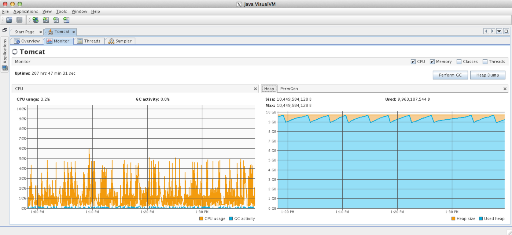
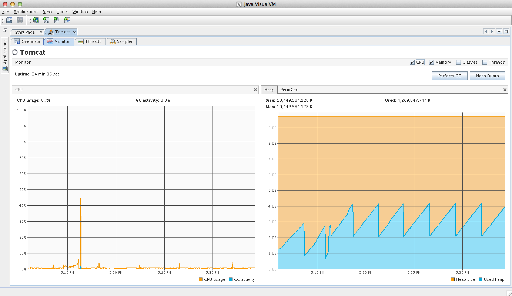

import Layout from "../components/Layout"

Fixing spiky CPU issues with Tomcat
===================================

The symptoms of spiking that we saw were simply that after light usage
of the applications, the CPU usage would start spiking and rapidly cycle
from many CPU cores (e.g. 2000% CPU usage) back to 0% CPU for no
apparent reason. 

We now know this was due to memory issues and garbage collection, but it
was confusing because it wasn't strictly showing up as GC usage in
JVisualVm (the GC usage, blue spikes on the left in fig 1, are small,
but the orange spikes are large, even though the memory issues are the
problem)

Here is what it looked like during spiking (obviously, pushing the
memory limits here, a linked in article suggests having 6GB of "newgen"
memory, so on top of the old gen, tomcat needs a bunch more for the
newgen to make things happy.

Here is what it looks like when it is not spiking

Edit: See this follow up post for showing that increasing memory helps
<http://searchvoidstar.tumblr.com/post/131229569383/tomcat-memory-debugging>

::: {#footer}
[ September 16th, 2015 6:37pm ]{#timestamp} [tomcat]{.tag} [java]{.tag}
[programming]{.tag} [coding]{.tag} [troubleshooting]{.tag}
[intermine]{.tag} [bioinformatics]{.tag}
:::

export default ({ children }) => <Layout>{children}</Layout>
