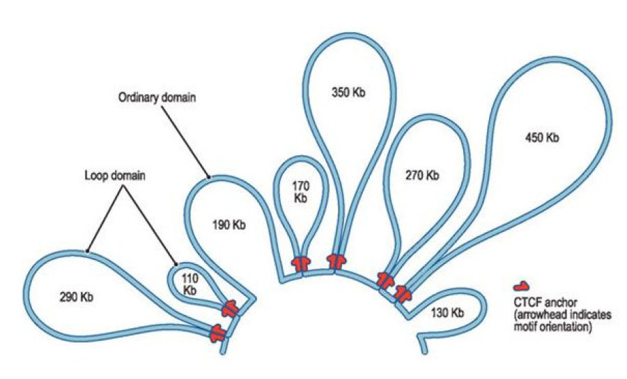

import Layout from "../components/Layout"

PAG XXIV 2016 highlights
========================

I am not a very realtime person when it comes to conferences, so I am
generally not livetweeting the action, but here I will try to list some
highlights of the PAGXXIV conference

\

Here are some choice memories

1\. In the Cattle workshop, a session discussed GWAS hits turning up
in badly misassembled regions (in this case in one of the badly
assembled ADAR gene regions)! Need better assemblies and annotations
(something we are working on with manual scaffolding and annotator
tools)

2\. Similarly, the low-quality, low-coverage (LQLC) annotation
project <http://www.ncbi.nlm.nih.gov/pubmed/26640477> was also great.
They saw similar needs and were working on new PacBio based genome
assemblies, albeit with large numbers of indels.

3\. Several awesome demonstrations were presented using CytoscapeJS,
notably by the QtlNetMiner tool and the BioCyc project. Both of these
tools were quite polished and looked awesome! I used the CytoscapeJS
project in my TumblrGraph experiment and found it to be an amazing
library.

4\. Not one but TWO shout outs to JBrowse during the plenary talks (Erez
Lieberman first name dropped it in the context of a really funny joke
about his cupcake rendition of chromatin loops, and next by Jorge
Dubcovsky in the context of their awesome Wheat TILLING tool)

Figure 1. Imagine this but made with cupcakes, and you'll understand
Erez Lieberman's enthusiasm during this part of his talk

\

5\. And a big plus for all our labs presentations during the session!

\

\

\

I may remember more cool things and add to this list over time, but
overall a great conference with outstanding work by everyone.

::: {#footer}
[ January 18th, 2016 9:59pm ]{#timestamp} [genomics]{.tag}
[PAGXXIV]{.tag} [science]{.tag}
:::

export default ({ children }) => <Layout>{children}</Layout>
