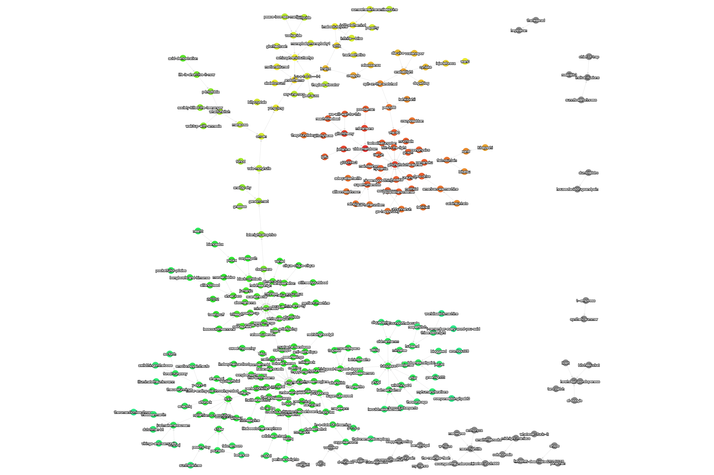

import Layout from "../components/Layout"

::: {.caption}
Made some updates to the tumblrgraph2 app to have "cose-bilkent" and
"spread" layouts. The cose-bilkent is especially awesome

\

<http://cmdcolin.github.io/tumblrgraph2/>
:::

::: {#footer}
[ March 23rd, 2016 3:20pm ]{#timestamp}
:::

export default ({ children }) => <Layout>{children}</Layout>
